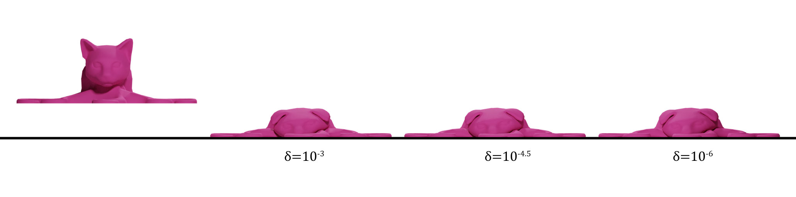
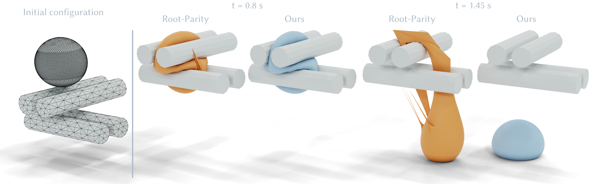

# Tight-Inclusion Continuous Collision Detection

[](https://github.com/Continuous-Collision-Detection/Tight-Inclusion/actions/workflows/continuous.yml)

<!--  -->


A conservative continuous collision detection (CCD) method with support for minimum separation.

To know more about this work, please read our ACM Transactions on Graphics paper:<br>
["A Large Scale Benchmark and an Inclusion-Based Algorithm for Continuous Collision Detection"](https://continuous-collision-detection.github.io/tight_inclusion/) and watch our [SIGGRAPH2022 talk video](https://www.youtube.com/watch?v=7cRg52cWL8c).

## Compiling Instruction

To compile the code, first make sure CMake is installed.

To build the library on Linux or macOS:
```sh
mkdir build
cd build
cmake ../ -DCMAKE_BUILD_TYPE=Release
make
```
Then you can run a CCD example:
```bash
./Tight_Inclusion_bin
```

### Optional

We also provide you an example to run the [Sample Queries](https://github.com/Continuous-Collision-Detection/Sample-Queries) using our CCD method. You may need to install `gmp` before compiling the code. Then set the CMake option `TIGHT_INCLUSION_WITH_TESTS` as `ON` when compiling:
```sh
cmake ../ -DCMAKE_BUILD_TYPE=Release -DTIGHT_INCLUSION_WITH_TESTS=ON
make
```
Then you can run `./Tight_Inclusion_bin` to test the handcrafted queries in the Sample Queries.
## Usage
Include `#include <tight_inclusion/ccd.hpp>`

To check edge-edge ccd, use `bool ticcd::edgeEdgeCCD()`;

To check vertex-face ccd, use `bool ticcd::vertexFaceCCD()`;

💡 If collision is detected, the ccd function will return `true`, otherwise, the ccd function will return `false`. Since our method is CONSERVATIVE, if the returned result is `false`, we guarantee that there is no collision happens. If the result is `true`, it is possible that there is no collision but we falsely report a collision, but we can guarantee that this happens only if the minimal distance between the two primitives in this time step is no larger than `tolerance + ms + err`. We wil explain these parameters below.  

For both edge-edge ccd and vertex-face ccd, the input CCD query is presented by 8 vertices which are in the format of `Eigen::Vector3d`. Please read our code in `tight_inclusion/ccd.hpp` for the correct input order of the vertices.

Beside the input vertices, there are some input and output parameters for users to tune the performace or to get more CCD information. Here is a list of the explanations of the parameters:

```
input:
    err                 The numerical filters of the x, y and z coordinates. It measures the errors introduced by floating-point calculation when solving inclusion functions.
    ms                  Minimum separation distance no less than 0. It guarantees that collision will be reported if the distance between the two primitives is less than ms.
    tolerance           User-specific solving precision. It is the target maximal x, y, and z length of the inclusion function. We suggest the user to set it as 1e-6.
    t_max               The time range [0, t_max] where we detect collisions. Since the input query implies the motion in time range [0, 1], t_max should no larger than 1.
    max_itr             The parameter to enable early termination of the algorithm. If you set max_itr < 0, early termination will be disabled, but this may cause longer runtime. We suggest to set max_itr = 1e6.
    CCD_TYPE            The parameter to choose collision detection algorithms. By default CCD_TYPE = 1. If set CCD_TYPE = 0, the code will switch to a naive conservative CCD algorithm, but lack of our advanced features.

output:
    toi                 Time of impact. If multiple collisions happen in this time step, it will return the earlist collision time. If there is no collision, the returned toi value will be std::numeric_limits<double>::infinity().
    output_tolerance    The real solving precision. If early termination is enabled, the solving precision may not reach the target precision. This parameter will return the real solving precision when the code is terminated.
```
## Tips
💡 The input parameter `err` is crucial to guarantee our algorithm to be a conservative method not affected by floating point rounding errors. To run a single query, you can set `err = Eigen::Array3d(-1, -1, -1)` to enable a sub-function to calculate the real numerical filters when solving CCD. If you are integrating our CCD in simulators, you need to:

- Include the headler: `#include <tight_inclusion/interval_root_finder.hpp>`.
- Call `std::array<double, 3> err_vf = ticcd::get_numerical_error()` and `std::array<double, 3> err_ee = ticcd::get_numerical_error()`
- Use the parameter `err_ee` each time you call `bool ticcd::edgeEdgeCCD()` and `err_vf` when you call `bool ticcd::vertexFaceCCD()`.

The parameters for function `ticcd::get_numerical_error()` is explained below:
```
input:
    vertices            Vertices of the Axies-Aligned-Bounding-Box of the simulation scene. Before you run the simulation, you need to conservatively estimate the Axies-Aligned-Bounding-Box in which the meshes will located during the whole simulation process, and the vertices should be the corners of the AABB.
    check_vf            A boolean instruction showing if you are checking vertex-face or edge-edge CCD.
    using_minimum_separation    A boolean instruction. If you are using minimum-separation CCD (the input parameter ms > 0), please set it as true.

```
💡 For some simulators which use non-zero minimum separation distance (`ms` > 0) to make sure intersection-free for each time-step, we have a CMake option `TIGHT_INCLUSION_WITH_NO_ZERO_TOI` to avoid the returned collision time `toi` is 0. You need to set `TIGHT_INCLUSION_WITH_NO_ZERO_TOI` as `ON` when compiling by: `cmake ../ -DCMAKE_BUILD_TYPE=Release -DTIGHT_INCLUSION_WITH_NO_ZERO_TOI=ON`. Then when you use the CCD functions, the code will continue the refinement in higher precision if the output `toi` is 0 under the given `tolerance`. So, the eventually `toi` will not be 0.

To have a better understand, or to get more details of our Tight-Inclusion CCD algorithm, please refer to our paper.

## Citation

If you use this work in your project, please consider citing the original paper:

```bibtex
@article{Wang:2021:Benchmark,
    title        = {A Large Scale Benchmark and an Inclusion-Based Algorithm for Continuous Collision Detection},
    author       = {Bolun Wang and Zachary Ferguson and Teseo Schneider and Xin Jiang and Marco Attene and Daniele Panozzo},
    year         = 2021,
    month        = oct,
    journal      = {ACM Transactions on Graphics},
    volume       = 40,
    number       = 5,
    articleno    = 188,
    numpages     = 16
}
```
